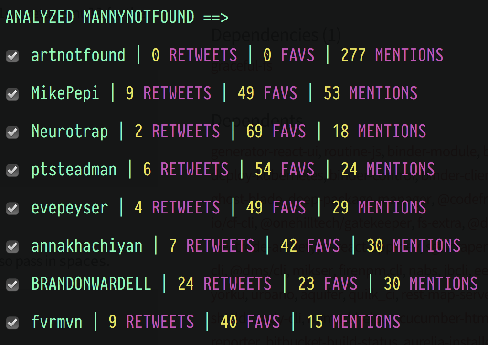

# tweetscrape

Recursively scrape Twitter networks.

<p align="center">
  
</p>

## about

`tweetscrape` is a multi purpose Twitter scraper. It can scrape tweets, favs, follows, for
a single user or recursively through a users network. 

## usage

Add one or more [twitter api](https://apps.twitter.com/) credentials to an `accounts.json` in project root

eg:

```js
[
  {
    "consumer_key": "XXX",
    "consumer_secret": "XXX",
    "access_token_key": "XXX",
    "access_token_secret": "XXX"
  },
  {
    "consumer_key": "XXX",
    "consumer_secret": "XXX",
    "access_token_key": "XXX",
    "access_token_secret": "XXX"
  },
  {
    "consumer_key": "XXX",
    "consumer_secret": "XXX",
    "access_token_key": "XXX",
    "access_token_secret": "XXX"
  }
]
```

## tweetscrape

`python tweetscrape.py -u [user] -r [optional recursive]`

#### recursive

passing the `-r` flag will run the script recursively which scrapes the first user,
then gets their "top 8" friends via `analyze.py`, and then continuously runs the scrape
on each friend while adding any new top 8 friends it finds in the process.

## single scrape

to scrape single features like tweets, favs, or follows, use:

`python scrape.py -u [user] -t [default: tweets] -f [favs] -fo [follows]`

__note: only 1 feature should be passed here, defaults to -t if none passed__

eg: `python scrape.py -u lilbthebasedgod -fo`

## analyze

this will pull whatever data is existing available on user and return their "top 8" friends.

`python analyze.py -u [user]`

eg: `python analyze.py -u lilbthebasedgod`

## Dependencies

```bash
pip install -r requirements.txt
```
